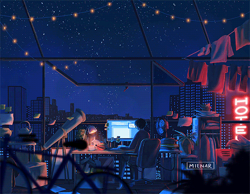

<h1 align="center">Hey, I'm Aamir. Welcome to my Profile! 👋</h1>

  

---

🔥 **Naturally curious, creatively coding, and constantly improving.** 🔥

---

### 👋 Hi, I’m **Mohd Aamir**  
### 👀 I’m interested in **Full Stack Development**  
### 🌱 Currently learning **Java, & DSA**  
### 🤝 Looking to collaborate on real-world web development projects  
### 📫 Reach me at: **mohdaamir0360@gmail.com**  
### 💬 Ask me anything!  
### ⚡ Fun fact: MDN knows more about my debugging struggles than my friends ever will 😭

---

## 🧰 Tech Stack

  

---

## 📊 GitHub Stats  

---

## 🎨 Aesthetic Developer Banner

  

---

## 🚀 About Me
- 🔭 Building cool projects using **Java + MERN Stack**  
- 💡 Love solving DSA questions & real-world problems  
- 🎯 Goal in 2025: Become a strong **Full Stack Developer**  
- 🌍 Based in **India**

---

## ☕ Support My Work

  

---

⭐ **If you like my profile, consider starring my repositories!**  
